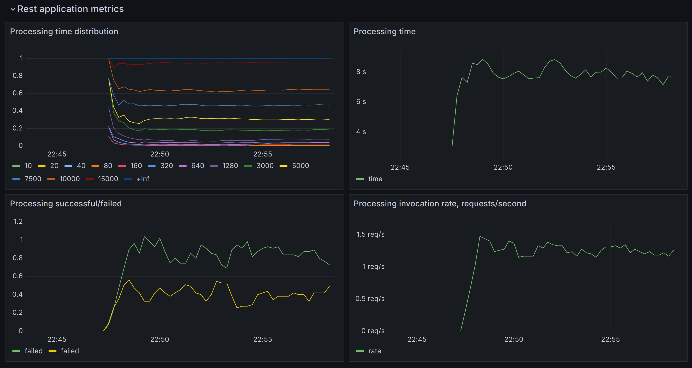

# Sample application with metrics collected by Prometheus and displayed in Grafana

The application consist of just one REST endpoint, which accepts request to run in-memory calculations.

The calculation process is emulated, nothing is really calculated, but it utilizes few scenarious:
- incoming requests rate;
- recorded processing time;
- rate of successful/failed processing;
- overall health of a Golang application.

## Structure
`.vscode` - configuration for a debugger

`cfg` - predefined configuration for Grafana and Premetheus: datasource, dashboards, scrap configuration

`processing` - Golang code for processing endpoint and processor mock

`readme-resources` - resources for README.md file

`rest` - code for REST server configuration

`samples/emulator` - http client for emulating load on a REST-endpoint, written in Golang

## Launch
1. Run docker dependencies first
```
docker compose up
```

that one starts Grafana and Prometheus up


2. Run Golang app
```
make run
```

3. Run load emulator
```
go run samples/emulator/load_emulator.go ./samples/emulator/
```

## Observe

